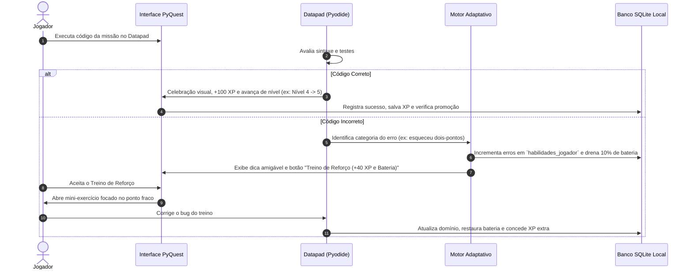
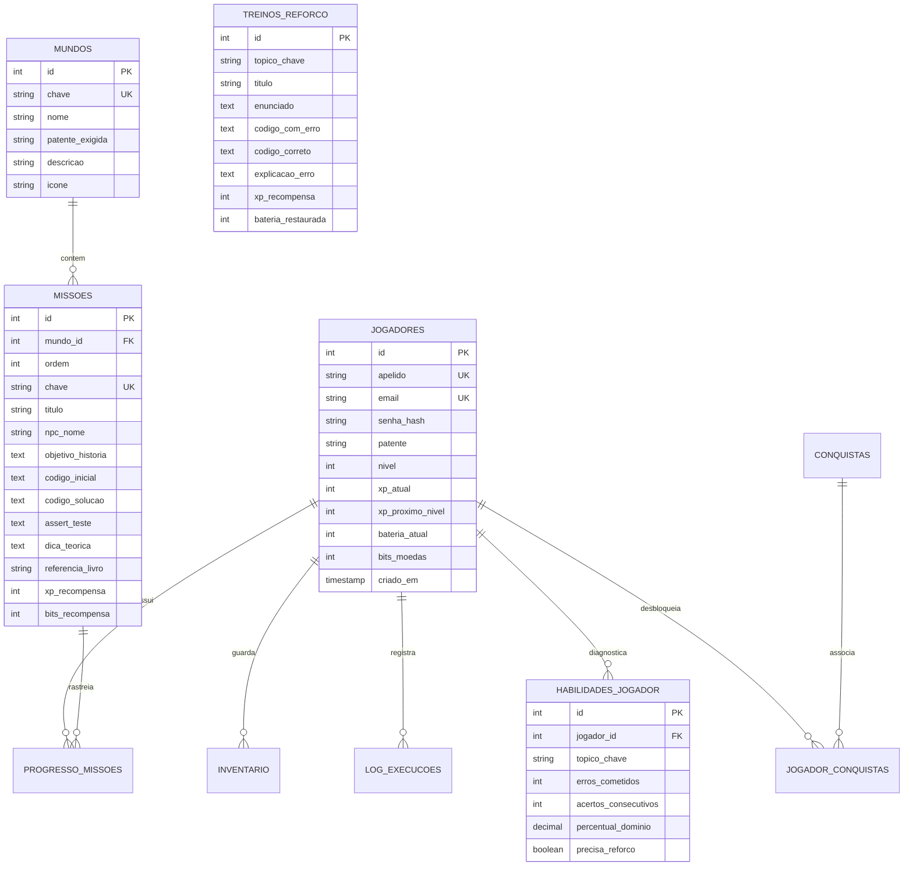

# 📋 Product Requirements Document (PRD)
# Projeto: PyQuest — As Crônicas dos Dados

---

## Contexto do Produto
* **Nome do Produto:** **PyQuest: As Crônicas dos Dados** *(Sugerido para unir narrativa lúdica à ciência de dados real)*
* **Ideia em uma frase:** Um RPG web educativo onde você aprende Python do zero à ciência de dados real através do console *Datapad*, resolvendo dilemas cotidianos de uma cidade mágica com progressão de Júnior, Pleno a Sênior.
* **Problema que resolve:** A barreira de entrada da programação é alta e frustrante. Tutoriais tradicionais, documentações extensas e cursos em vídeo são passivos, abstratos e desmotivadores; ensinam sintaxe desconectada da vida real e geram a falsa ilusão de aprendizado.
* **Público-alvo:** Desde crianças curiosas (10+) até adultos em transição de carreira ou calouros universitários que aprendem melhor através de narrativa, desafios práticos e feedback visual imediato.
* **Como o usuário resolve esse problema hoje:** Lê documentações técnicas densas, assiste videoaulas longas no YouTube sem praticar, ou tenta usar plataformas punitivas como LeetCode que assustam iniciantes.
* **Modelo de Negócio:** Gratuito (open-source e de uso pessoal/comunitário inicial, sem paywalls).
* **Precisa de login?** Sim, modelado de forma didática com autenticação local/persistente em SQLite (o próprio sistema de login faz parte do aprendizado prático de Python e dados).
* **Precisa de pagamentos?** Não no MVP.
* **Prazo para o MVP:** **40 dias**.

---

## 1. Visão Geral

### 1.1 Nome do Produto
**PyQuest: As Crônicas dos Dados** (Codinome: *ByteQuest Engine*)

### 1.2 Elevator Pitch
Para qualquer pessoa — de uma criança de 10 anos a um adulto buscando recolocação profissional — que trava diante de documentações frias e códigos sem contexto, o **PyQuest** é um jogo de aventura em formato web app que transforma o aprendizado de Python em uma jornada épica com o *Datapad*. Nele, você programa em Python de verdade para resolver problemas tangíveis do cotidiano (calcular troco na mercearia, filtrar pistas de um mistério, automatizar regadores e analisar dados de uma cidade), evoluindo sua patente de Júnior a Sênior com execução em tempo real e banco de dados real.

### 1.3 Objetivo do MVP (Meta dos 40 Dias)
Lançar uma versão jogável e estável contendo:
1. O **Vilarejo de Valedados (Mundo 1: Patente Júnior)** com visual autêntico em **Pixel Art** e **mapa visível do vilarejo**, contendo 6 missões completas fundamentadas nas referências bibliográficas (*Pense em Python*, *Python Para Leigos*, *Casa do Código* e *Data Science do Zero*).
2. **Terminal Datapad Autêntico com sensação nativa de CLI**, suportando Python 3 via WebAssembly (Pyodide / xterm.js), prompt interativo real, destaque de sintaxe, histórico de comandos e testes automáticos com feedback humanizado.
3. Banco de dados relacional em **MySQL** (gerenciado localmente via XAMPP / phpMyAdmin com API Node.js/Express) modelado para autenticação, progresso, inventário, conquistas, histórico de erros adaptativos e tabelas de missões.
4. Sistema de gamificação ativo com ganho/perda de XP (níveis 1 a 50 no Júnior), Bateria do Datapad e recompensas.

### 1.4 Pilar Conceitual de Game Design: "A Theory of Fun for Game Design" (Raph Koster)
O design pedagógico do PyQuest adota como alicerce epistemológico a tese seminal de Raph Koster: **"A diversão é a resposta emocional e biológica do cérebro ao aprendizado e ao domínio de padrões"**.
* **O Cérebro como Máquina de Padrões:** A mente humana busca constantemente identificar estruturas previsíveis no caos. Programar em Python nada mais é do que o ápice do reconhecimento e orquestração de padrões lógicos (loops, condicionais, tipos e funções).
* **A Evitação do Tédio e da Frustração (Flow):** Segundo Koster, um jogo torna-se entediante quando os padrões se esgotam (tutoriais fáceis demais) e frustrante quando o padrão é incompreensível (erros de compilação sem contexto). A escala dos primeiros 50 níveis do PyQuest dosa a complexidade passo a passo para manter crianças e adultos na **Zona de Flow**.
* **O Momento de "Grokking" (A Epifania do Aprendizado):** O jogo é arquitetado para gerar a sensação de *Grok* — o instante exato em que o jogador internaliza a lógica do algoritmo e vê o mundo do jogo se transformar através do código que ele mesmo escreveu.

### 1.5 Direção de Arte: Estilo Pixel Art & Mapa Interativo do Vilarejo
* **Estética Retrô 16-bit / Top-Down RPG:** A interface não deve se parecer com um painel SaaS ou aplicativo corporativo genérico. A identidade visual adotará a estética consagrada dos clássicos RPGs 16-bit (estilo *Chrono Trigger*, *Earthbound*, *Zelda: The Minish Cap* e *Pokémon*).
* **Mapa Visível do Vilarejo de Valedados:** O mapa do vilarejo deve ser **visível diretamente na interface principal do jogo** (via Canvas / Tilemap 2D), apresentando:
  * Ruas de paralelepípedos, praça central, fontes de água e vegetação animada.
  * Construções icônicas dos NPCs: o Armazém do Seu Zé, a Estação de Pipoca da Bia, a Catraca do Parque do Roberto, a Praça dos Regadores da Dona Flor, a Biblioteca do Arquimedes e a Torre da Mestre Ada.
  * Pontos de interesse e NPCs com balões de exclamação (`!`) para indicar missões disponíveis e status de conclusão (marcos visuais de conquista no próprio mapa).
* **Paleta de Cores Integrada:** Os tilesets, sprites e cenários em pixel art devem harmonizar estritamente com a paleta oficial: *Jet Black* (`#022b3a`), *Teal* (`#1f7a8c`), *Pale Sky* (`#bfdbf7`), *Lavender* (`#e1e5f2`) e *White* (`#ffffff`).

### 1.6 Experiência de Terminal Datapad Nativo (Sensação Real de CLI)
* **Adeus aos Textareas Genéricos:** O console de código do aluno não pode parecer um mero formulário HTML estático. Deve entregar a sensação tátil e auditiva de um **Terminal de Desenvolvedor Nativo** embutido no aparelho cibernético *Datapad*:
  * **Emulação Real de Terminal:** Integração com emulador de terminal real (ex: `xterm.js` ou console CRT estilizado com fonte *Fira Code* / *Press Start 2P*).
  * **Sensação de Linha de Comando:** Prompt interativo estilizado (`>>>` ou `aprendiz@valedados:~$`), cursor em bloco piscante autêntico, separação visual cristalina de `stdout`, `stderr` e tracebacks formatados.
  * **Interatividade Real:** Capacidade de receber comandos, histórico de execução (setas para cima/baixo), suporte à função `input()` interativa com prompt no terminal.
  * **Feedback Visual de Máquina:** Indicador de compilação com efeito de linhas de scan (scanlines retrô opcionais), luzes de status do Datapad e alerta de bateria baixa com efeito de glitch ou chiado digital sutil.

---

## 2. Personas

### Persona 1: A Criança Exploradora (10 a 14 anos)
* **Nome:** Leo Prado (12 anos).
* **Perfil:** Estudante do ensino fundamental, apaixonado por Minecraft, Roblox e enigmas de videogame.
* **Dores principais:** Quer entender "como os computadores e os jogos pensam", mas quando abre um livro de programação convencional se depara com termos em inglês difíceis e fórmulas matemáticas sem graça.
* **O que quer alcançar:** Sentir que tem superpoderes no computador, automatizando coisas divertidas e descobrindo segredos escondidos através dos dados.
* **Como descobre o produto:** Recomendação em canal de tecnologia, indicação escolar ou compartilhado por parentes/professores.

### Persona 2: O Adulto em Transição / Universitário (20 a 35 anos)
* **Nome:** Camila Vasconcelos (27 anos).
* **Perfil:** Analista administrativa querendo migrar para Análise de Dados e Ciência de Dados.
* **Dores principais:** Tentou ler documentações técnicas e livros densos, mas desiste no 3º capítulo porque não consegue aplicar na prática imediata. Sente síndrome do impostor com terminais pretos e erros incompreensíveis.
* **O que quer alcançar:** Construir raciocínio computacional sólido e entender como manipular dados reais sem medo, construindo uma base teórica rigorosa sem sofrimento.
* **Como descobre o produto:** Posts no LinkedIn/GitHub, comunidades de programação (Discord, Reddit, grupos de faculdade).

---

## 3. User Stories Priorizadas (MoSCoW)

### 🔴 Must Have (Sem isso o MVP de 40 dias não funciona)
1. **US01:** Como jogador, quero criar um perfil com apelido e senha para ter meu progresso, XP e patentes salvos em um banco de dados MySQL persistente local (XAMPP).
2. **US02:** Como jogador, quero visualizar o **mapa do vilarejo em Pixel Art (estilo RPG 16-bit)** com construções e NPCs visíveis, para explorar os cenários e interagir com as missões do cotidiano.
3. **US03:** Como jogador, quero um **Terminal Datapad que transmita a sensação de uma CLI nativa** (com prompt autêntico `>>>`, emulador real de console, destaque de sintaxe e histórico) para me sentir programando como um desenvolvedor de verdade.
4. **US04:** Como jogador, quero executar meu código Python em tempo real no navegador e ver o efeito imediato no cenário do jogo.
5. **US05:** Como jogador, quero um motor de testes que valide meu código e traduza erros de sintaxe para mensagens educativas baseadas na metodologia de depuração do *Pense em Python*.
6. **US06:** Como jogador, quero ganhar XP (+100 XP por missão, +50 bônus) e subir de nível na patente de Júnior até o final do Mundo 1.
7. **US07:** Como jogador, quero que o Datapad tenha uma bateria de 100% que drene 10% por erro e ofereça um mini-desafio de recarga rápida para que o erro vire aprendizado.
8. **US08:** Como estudante, quero exportar o código de qualquer missão diretamente para o Google Colab em 1 clique.

### 🟡 Should Have (Importante, planejado dentro da janela de 40 dias)
9. **US09:** Como jogador, quero uma loja de recompensas de Valedados para trocar Bits (moedas) por novas cores de interface do Datapad (baseadas na paleta *Jet Black/Teal*).
10. **US10:** Como jogador, quero um inventário visual da mochila com itens coletados gerenciados como um dicionário/lista de Python.
11. **US11:** Como jogador, quero um botão "Dica do Mestre" que forneça pistas conceituais tiradas das obras de referência (*Downey / Mueller / Grus*).

### 🟢 Could Have (Desejável se sobrar tempo nos 40 dias)
12. **US12:** Como jogador, quero efeitos sonoros retrô 8-bit sutis ao compilar com sucesso ou falhar.
13. **US13:** Como jogador, quero modo tela cheia para imersão total no estilo jogo de console.

### ⚪ Won't Have (Explicitamente fora do MVP)
14. Servidor em nuvem com autenticação OAuth (Google/Github).
15. Modo multijogador em tempo real ou chat online.
16. Sistema de pagamentos, assinaturas ou microtransações.
17. Fases de Machine Learning avançado e Redes Neurais (planejadas para a expansão Sênior v2.0).

---

## 4. Features do MVP (Apenas Must Have)

### Feature 1: Sistema de Perfil & Persistência Relacional MySQL
* **Descrição:** Criação e persistência do jogador em banco de dados **MySQL nativo** (`pyquest_db`) gerenciado via XAMPP / phpMyAdmin através de API Node.js/Express, armazenando tabelas de `jogadores`, `progresso_missoes`, `inventario`, `habilidades_jogador`, `treinos_reforco` e `log_execucoes`.
* **Critérios de Aceitação:**
  * O jogador cadastra apelido, e-mail e senha (armazenada com hash `bcrypt`).
  * O estado de XP, nível (1 a 50), bateria, bits e histórico de missões persiste com segurança no MySQL.
* **Dependências:** Nenhuma.

### Feature 2: Terminal Datapad Autêntico (Experiência Nativa de CLI)
* **Descrição:** Console de desenvolvimento imersivo que emula a experiência real de uma linha de comando de desenvolvedor (via `xterm.js` / WebAssembly Pyodide), fugindo completamente do aspecto de uma simples `textarea` web:
  * Prompt interativo autêntico (`>>>` de REPL ou `aprendiz@valedados:~$`).
  * Cursor em bloco piscante, histórico de comandos com setas `↑` e `↓`, autocompletar e suporte a `input()` interativo direto no console.
  * Saída com destaque de sintaxe, colorização de logs (`stdout` vs `stderr`) e mensagens de depuração legíveis.
* **Critérios de Aceitação:**
  * O terminal deve parecer e se comportar como uma CLI nativa embutida no Datapad.
  * Executa scripts com `print()`, tipos, condicionais, laços e funções em menos de 1 segundo.
* **Dependências:** Feature 1.

### Feature 3: Mapa do Vilarejo em Pixel Art & Trilha Pedagógica (Mundo 1 - Júnior)
* **Descrição:** Interface visual no estilo clássico de RPG 16-bit com o **mapa do Vilarejo de Valedados visível**, permitindo que o jogador veja o cenário, as construções e os NPCs com quem vai interagir para realizar as 6 missões práticas inspiradas nos livros de referência:
  1. *Missão 1 (A Balança da Mercearia):* Variáveis, tipos primitivos (`int`, `float`, `str`) e arredondamento (*Para Leigos*, Cap. 5).
  2. *Missão 2 (O Cofrinho da Turma):* Entrada de dados, conversão de tipo (casting) e cálculo de troco com f-strings (*Casa do Código*, Cap. 2).
  3. *Missão 3 (A Catraca Justa do Parque):* Condicionais `if/elif/else` e a regra da peneira (*Pense em Python*, Cap. 5).
  4. *Missão 4 (O Robô Regador da Praça):* Laços de repetição `for` e `range()` para automatizar tarefas (*Para Leigos*, Cap. 7).
  5. *Missão 5 (O Detector de Nulos da Biblioteca):* Tratamento de erros básicos, listas mutáveis e verificação de dados ausentes (*Data Science do Zero*, Cap. 2).
  6. *Missão 6 (O Desafio do Mestre Júnior):* Função completa reutilizável com `def` e validação com `return` (*Pense em Python*, Cap. 3).
* **Critérios de Aceitação:**
  * O mapa em pixel art exibe claramente as construções da vila e os locais de cada NPC.
  * Cada missão possui história imersiva, código base e suíte de testes automáticos.
* **Dependências:** Feature 2.

### Feature 4: Motor de Depuração & Validação Amigável
* **Descrição:** Analisador de erros que intercepta exceções do Python (`SyntaxError`, `TypeError`, `IndentationError`) e as traduz para explicações cotidianas baseadas no livro *Pense em Python*.
* **Critérios de Aceitação:**
  * Erros comuns (como esquecer dois-pontos `:` ou misturar texto com número) exibem uma dica explicativa em português claro, em vez do traceback cru.
* **Dependências:** Feature 2 e 3.

### Feature 5: Escala de 50 Níveis (MVP Júnior) & Trilha de Maestria até Level 160
* **Descrição:** Sistema granular de progressão do jogador com marcos claros de competência técnica:
  * **🥉 Níveis 1 a 50 — Patente Básico / Júnior (Escopo Total do MVP de 40 dias):**
    * *Níveis 1 a 10:* Primeiros Passos & Variáveis (tipos primitivos, casting, input, cálculos e f-strings).
    * *Níveis 11 a 25:* Tomada de Decisão & Lógica (`if/elif/else`, operadores `and/or/not`, regra da peneira).
    * *Níveis 26 a 40:* Automação & Laços (`for`, `range`, `while`, contadores, acumuladores, `break` e `continue`).
    * *Níveis 41 a 49:* Funções & Robustez (`def`, escopo de variáveis, `return`, tratamento básico de erros com `try/except`).
    * *Nível 50:* Desafio do Mestre Júnior (Projeto Integrador prático) que libera a promoção oficial para o Nível 51!
  * **🥈 Níveis 51 a 110 — Patente Pleno (Mundo 2 - Expansão Futura):** Coleções avançadas (`lists`, `tuples`, `dicts`, `sets`), POO profunda, SQLite CRUD e análise de dados com Pandas.
  * **🥇 Níveis 111 a 160 — Patente Sênior / Mestre Arquiteto (Mundo 3 - Maestria Completa):** Clean Code, suítes de testes (`unittest/doctest`), algoritmos, visualização com Seaborn e Inteligência Artificial do zero (*Data Science do Zero*).
* **Critérios de Aceitação:**
  * Curva de XP calibrada: cada nível do MVP requer uma quantidade incremental de XP, permitindo subir de nível tanto através das missões principais quanto pelos treinos de reforço.
  * Ao atingir o Level 50, o jogador recebe o distintivo lendário "Engenheiro Júnior Formado" e o convite cerimonial para a Patente Pleno (Level 51).
* **Dependências:** Features 1, 2 e 3.

### Feature 6: Motor Adaptativo de Diagnóstico & Treinos de Reforço (Farm de XP)
* **Descrição:** Mecânica inteligente que mapeia onde o usuário mais comete erros (ex: confundir `=` com `==`, esquecer `:` nos blocos, tentar concatenar texto com número sem casting, errar os limites do `range`, esquecer `return` em funções).
* **Mecânica de Jogo:**
  * O Datapad monitora e atualiza a tabela relacional `habilidades_jogador`.
  * Se o jogador estiver com dificuldades em um tópico específico ou sem XP suficiente para a próxima missão principal, a aba **"Central de Treinamento"** oferece exercícios curtos de correção de bugs da tabela `treinos_reforco`.
  * Cada treino concluído concede **+40 XP** e regenera **+35% da Bateria do Datapad**, transformando a superação do erro na principal fonte de fortalecimento do jogador.
* **Critérios de Aceitação:**
  * Registra o diagnóstico no banco SQLite local.
  * Sugere treinos direcionados quando a bateria estiver baixa ou após 2 erros consecutivos no mesmo tópico.
* **Dependências:** Feature 1, 2 e 5.

---

## 5. Fluxos Principais

### Passo a Passo dos Fluxos:
1. **Primeiro Acesso:** O jogador abre a URL, visualiza a introdução animada de Valedados, escolhe seu nome/avatar e o sistema inicializa o banco SQLite local com 0 XP e Bateria em 100%.
2. **Loop de Jogo:**
   - O jogador aceita a missão de um cidadão da vila.
   - Lê a analogia do dia a dia e inspeciona o código base no Datapad.
   - Escreve os comandos em Python e clica em **"▶ Executar no Datapad"**.
   - O código é validado: se correto, ganha XP, moedas Bits e avança no mapa; se incorreto, recebe dica didática de depuração e consome bateria.

---

## 6. Regras de Negócio

* **RN01:** O jogador só pode avançar para a próxima missão após passar em 100% dos testes unitários da fase atual.
* **RN02:** Toda execução de código é estritamente client-side (no navegador do usuário), garantindo privacidade e sem consumo de créditos em nuvem.
* **RN03:** O sistema deve manter a integridade dos dados no SQLite local: se o usuário fechar a aba ou atualizar (F5), seu estado é restaurado fielmente.
* **RN04:** Erros de código não punem o jogador com "Game Over" definitivo; a bateria zerada exige apenas a resolução de 1 pergunta de fixação para restaurar a energia (foco em reforço positivo).
* **RN05:** Todos os layouts visuais devem seguir a paleta oficial: *Jet Black* (`#022b3a`), *Teal* (`#1f7a8c`), *Pale Sky* (`#bfdbf7`), *Lavender* (`#e1e5f2`) e *White* (`#ffffff`).

---

## 7. Fora do Escopo do MVP

* Sistema de pagamentos ou cobranças.
* Modos PvP (Player vs Player) ou batalhas competitivas em tempo real.
* Módulos avançados de Deep Learning com TensorFlow ou redes neurais convolucionais.
* Integração com hardware físico (placas Arduino, micro:bit, etc.).

---

## 8. Requisitos Não-Funcionais

* **Performance:** Carregamento inicial da casca do jogo em menos de **1.8s**; tempo de execução de códigos simples pelo Pyodide menor que **800ms**.
* **Segurança:** O código executado no Pyodide roda isolado em sandbox de WebAssembly no navegador do próprio cliente, sem permissão para acessar o sistema de arquivos local da máquina do usuário.
* **Acessibilidade:** Conformidade com **WCAG 2.1 nível AA** (contraste de fontes adequado, textos legíveis para crianças e adultos, suporte a navegação por teclado).
* **Compatibilidade:** Funcionamento impecável em Google Chrome, Mozilla Firefox, Microsoft Edge e Safari (Desktop e Mobile com suporte touch swipe).
* **LGPD / Privacidade:** Coleta de dados zero. Todos os dados permanecem única e exclusivamente no dispositivo do jogador.

---

## 9. Métricas de Sucesso (Validação dos 40 Dias)

1. **Taxa de Conclusão do Mundo Júnior:** Ao menos **70%** dos jogadores que iniciam a Missão 1 concluem as 6 missões do Mundo 1.
2. **Tempo Médio de Permanência:** Sessões médias superiores a **15 minutos** de engajamento ativo.
3. **Índice de Retenção do Aprendizado:** Mais de **80%** de acerto nas perguntas de recarga de bateria na primeira tentativa (validando a eficácia das dicas).
4. **Exportação Colab:** Mais de **25%** dos usuários utilizam a ferramenta para salvar códigos no Google Colab.

---

## 10. Decisões Técnicas Iniciais & Arquitetura de Dados

### 10.1 Banco de Dados Relacional (MySQL no XAMPP)
O banco de dados é um pilar de produto e de aprendizado. Para o MVP, adotamos o **MySQL (gerenciado via XAMPP / phpMyAdmin na porta 3306)** com o schema [database_schema_mysql.sql](file:///c:/xampp/htdocs/python-aula/database_schema_mysql.sql) e API REST em Node.js (`server/`).

#### Diagrama de Entidade-Relacionamento (DER):

### 10.2 Stack Tecnológico & Diretrizes de Apresentação
* **Direção de Arte & Renderização:** Estilo **Pixel Art 16-bit** com **Mapa Visível do Vilarejo de Valedados** (renderizado via Canvas / Tilemap 2D interativo com sprites de caminhos, casas dos NPCs, fontes e vegetação).
* **Console Datapad:** Experiência de **Terminal Nativo / CLI Real** (emulador de terminal estilo `xterm.js` / WebAssembly, prompt `>>>`, histórico de comandos, colorização de sintaxe e logs de execução autênticos).
* **Python Runtime:** Pyodide WebAssembly (Python 3.12 real executado de forma segura no navegador do aluno).
* **Backend API:** Node.js + Express (`server/`) com driver `mysql2/promise` estruturado em camadas.
* **Database Engine:** MySQL / MariaDB via XAMPP (`localhost:3306`), banco `pyquest_db`.
* **Identidade Visual:** Paleta oficial estrita:
  * `--jet-black: #022b3a`
  * `--teal: #1f7a8c`
  * `--pale-sky: #bfdbf7`
  * `--lavender: #e1e5f2`
  * `--white: #ffffff`
