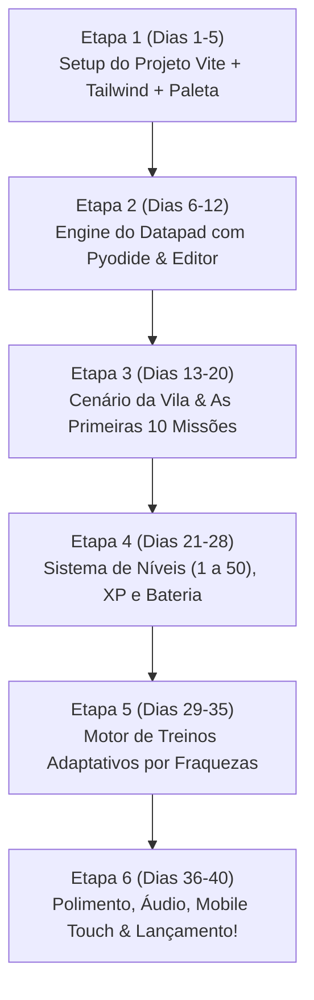

# 🛠️ Arquitetura de Software e Stack Técnica (TECH_STACK.md)
# Projeto: PyQuest — As Crônicas dos Dados

> **Autor:** Engenheiro Full-Stack Sênior & Arquiteto de Software  
> **Público-alvo deste documento:** Web Designers e desenvolvedores iniciantes em código.  
> **Objetivo:** Definir as tecnologias ideais para o MVP do **PyQuest**, explicando cada escolha sem termos complicados, justificando o porquê e garantindo máxima segurança e agilidade.

---

## 1. Stack Frontend

### Escolha Recomendada: **Vite + React**

* **Por que essa escolha se encaixa no PRD (em linguagem simples)?**  
  O **PyQuest** é um jogo/simulador interativo de RPG com editor de código, barra de vida/bateria, execução de Python via WebAssembly (Pyodide) e atualizações constantes na tela.  
  O **Vite + React** funciona como uma oficina de montagem ultra-rápida: ele carrega em milissegundos no seu computador, não tenta "adivinhar" renderizações no servidor (o que costuma dar erros chatos de compatibilidade quando usamos compiladores pesados no navegador como o Pyodide) e permite que você construa a interface visual como se estivesse juntando blocos de LEGO (componentes).

* **Quais trade-offs (pontos de troca) estamos aceitando?**  
  * *O que ganhamos:* Simplicidade extrema de configuração, velocidade máxima de desenvolvimento local e zero dores de cabeça com scripts que rodam apenas no navegador (como o interpretador de Python WebAssembly).
  * *O que abrimos mão:* Não temos renderização no servidor (SSR) nem otimização avançada para buscadores (SEO no Google). Mas como o PyQuest é um **web app de jogo interativo** focado na experiência do usuário logado/jogando, e não um blog de notícias, essa troca é a mais inteligente e segura.

* **Versão recomendada:**  
  * **Vite:** 5.x / 6.x  
  * **React:** 18.x (ou 19 estável) com TypeScript (para evitar erros bobos de digitação).

* **O que o aluno precisa ter instalado no computador?**  
  1. **Node.js** (versão 20 LTS ou superior) — baixe direto em [nodejs.org](https://nodejs.org).  
  2. **VS Code** (editor de código gratuito recomendado).  
  3. No terminal da pasta do projeto, basta rodar:
     ```bash
     npm create vite@latest pyquest-app -- --template react-ts
     ```

---

## 2. Estilização

### 2.1 Padrão: **Tailwind CSS**
* **O que é em linguagem simples:** Imagine que em vez de ter que criar um arquivo separado de estilos gigante e inventar nomes difíceis para classes, você estiliza os elementos diretamente no HTML usando palavras em inglês curtas e intuitivas (ex: `bg-slate-900`, `text-white`, `p-4` para espaçamento, `rounded-xl` para cantos arredondados).
* **Por que é essencial:** É o padrão absoluto da indústria moderna. Permite que você, como web designer, crie telas no visual exato da nossa paleta (*Jet Black*, *Teal*, *Pale Sky*, *Lavender*, *White*) sem perder horas caçando erros de CSS.

### 2.2 Componentes Prontos: **shadcn/ui**
* **O que é em linguagem simples:** É como ter uma caixa com os melhores componentes de interface do mundo (botões modernos, caixas de diálogo, modais de vitória, barras de progresso, abas) já desenhados com acessibilidade de ponta.
* **Por que é essencial:** Você não precisa reinventar a roda criando um modal do zero. Os componentes são copiados para dentro da sua própria pasta de código, o que significa que **você tem 100% de controle visual** para pintar com as cores do PyQuest.

---

## 3. Backend e Banco de Dados

> **Conceito em 2 linhas:**  
> * **Backend** é o "cérebro invisível" que roda fora da vista do usuário para validar regras secretas e fazer a ponte segura.  
> * **Banco de Dados** é o "cofre digital organizado" onde guardamos as tabelas de jogadores, XP, inventário e missões salvas para que nada se perca quando a página é fechada.

### Recomendação: **MySQL (via XAMPP / phpMyAdmin)** com API leve em Node.js (Express)

* **Por que o MySQL é a escolha ideal agora:**  
  Como já estamos trabalhando dentro da pasta do **XAMPP (`C:\xampp\htdocs`)**, o seu computador já possui o **MySQL** instalado e pronto para rodar!
  1. **Zero dependência de serviços na nuvem:** Tudo roda localmente no seu computador (`localhost:3306`), sem precisar cadastrar cartão ou criar contas externas.
  2. **Gerenciador Visual (phpMyAdmin):** Você gerencia o banco abrindo `http://localhost/phpmyadmin` no seu navegador — uma interface visual onde você cria bancos, vê tabelas e confere registros com cliques, perfeito para quem vem de web design.
  3. **A Ponte Segura (Backend em Express + mysql2):** Como um aplicativo frontend no navegador não pode se conectar diretamente ao MySQL por questões de segurança (isso exporia a senha do banco para qualquer visitante), criamos uma pequena API intermediária em **Node.js (Express com biblioteca `mysql2`)**. Ela recebe os pedidos do jogo React e faz as consultas seguras no MySQL com queries parametrizadas (evitando ataques de SQL Injection).

---

## 4. Autenticação

> **O que é autenticação em linguagem simples:**  
> É o porteiro digital do sistema. Ele verifica se quem está tentando entrar é realmente o dono daquele perfil através de um e-mail, senha ou chave secreta.

### Recomendação: **Autenticação Local via MySQL + JWT (com Suporte a Convidado)**
* **Como funciona no PyQuest:**  
  1. **Modo Convidado / Criança (Atrito Zero):** O jogador escolhe um apelido e avatar e começa a jogar na hora. O sistema salva o perfil no MySQL e devolve uma chave de identificação local.
  2. **Modo Conta Protegida:** Para quem quiser senha, a API recebe a senha, transforma em um código criptografado seguro com **`bcrypt`** (nunca salvamos senhas puras em texto no banco!) e guarda na tabela `jogadores` do MySQL.
  3. **O Crachá Digital (JWT):** Quando o jogador faz login com sucesso, a API emite um "crachá digital temporário" (Token JWT) que o React usa em cada requisição para provar que é ele mesmo.

---

## 5. Pagamentos

> **O que é um gateway de pagamento em linguagem simples:**  
> É uma empresa financeira especializada (como a maquininha de cartão, só que para a internet) que processa pagamentos via Pix ou Cartão de Crédito com criptografia de ponta a ponta.

### Recomendação no MVP: **Nenhum (Gratuito / Fora do Escopo)**
* O PRD define o projeto como **100% gratuito** no MVP.
* Se no futuro você quiser vender expansões cosméticas (skins para o Datapad) ou cursos avançados, o padrão absoluto recomendado da indústria é o **Stripe** (ou gateway com suporte nativo a Pix no Brasil).

---

## 6. Hospedagem e Publicação

> **O que é hospedagem em linguagem simples:**  
> É um computador potente e conectado à internet 24 horas por dia, 7 dias por semana, onde os arquivos do seu aplicativo ficam guardados para que qualquer pessoa do planeta possa acessar através de um link.

### Recomendação:
* **Durante os 40 dias de desenvolvimento:** O jogo roda **100% localmente no seu computador** através do XAMPP (Apache + MySQL) e do servidor local de desenvolvimento do Vite (`http://localhost:5173`). Você não precisa pagar nem configurar nenhum servidor na nuvem.
* **Para quando quiser publicar na internet:** O banco MySQL pode ser migrado com 1 clique para provedores gratuitos/acessíveis (como PlanetScale, Railway ou VPS local), e o frontend React publicado na **Vercel** ou no **GitHub Pages**.

---

## 7. Bibliotecas Principais

Instalaremos **apenas o estritamente necessário**, mantendo o app leve e seguro:

1. **`react-hook-form` + `zod`**  
   * *O que faz:* Gerencia e valida campos de texto e formulários.  
   * *Por que é obrigatória:* Evita que o jogador digite nomes maliciosos ou dados quebrados, garantindo segurança e mensagens de erro amigáveis antes de salvar.
2. **`@xterm/xterm` (ou `xterm.js`)**  
   * *O que faz:* Emulador de terminal completo e autêntico usado pelas maiores ferramentas do mundo (inclusive o próprio terminal integrado do VS Code).  
   * *Por que é obrigatória:* Transforma o *Datapad* em um **terminal nativo real** com prompt de comando (`>>>`), cursor em bloco piscante, suporte a `input()` interativo e colorização de saídas de erro e sucesso, eliminando qualquer aspecto de simples formulário web.
3. **`@monaco-editor/react` (ou CodeMirror 6)**  
   * *O que faz:* O mesmo motor de edição de código do VS Code embutido no navegador.  
   * *Por que é necessária:* Fornece autocompletar inteligente, numeração de linhas, realce de sintaxe em Python e indentação automática perfeita.
4. **HTML5 Canvas 2D / Tilemap Engine**  
   * *O que faz:* Motor de desenho em pixels para renderizar o **mapa do Vilarejo de Valedados em Pixel Art 16-bit**.  
   * *Por que é necessária:* Permite renderizar o cenário do vilarejo de forma visível, com ruas, casas dos NPCs, fontes e marcadores de missão interativos.
5. **`pyodide`**  
   * *O que faz:* O motor do Python 3 oficial compilado para WebAssembly.  
   * *Por que é necessária:* Executa os códigos Python das missões diretamente na máquina do jogador com zero custo de servidor e altíssima velocidade.
6. **`canvas-confetti` + `lucide-react`**  
   * *O que faz:* Efeitos visuais de conquista e ícones modernos para a interface de jogo.  
   * *Por que é necessária:* Cria o reforço positivo e celebração de level up com base na *Teoria da Diversão de Raph Koster*.

---

## 8. Estrutura de Pastas

Uma organização limpa e modular integrando o frontend React com o backend leve do MySQL:

```text
pyquest-app/
├── public/                     # Arquivos estáticos (ícones, sprites do avatar, sons 8-bit)
├── src/                        # FRONTEND (React + Vite)
│   ├── assets/                 # Imagens, logos e ilustrações da vila de Valedados
│   ├── components/             # Blocos visuais reutilizáveis
│   │   ├── ui/                 # Componentes básicos do shadcn (Button, Card, Dialog, Progress)
│   │   ├── game/               # Componentes do jogo (CenarioVila, Datapad, BateriaBar, XpCounter)
│   │   └── editor/             # O editor de código Monaco com os botões de Executar e Colab
│   ├── hooks/                  # Lógicas reutilizáveis (usePyodide, usePlayerState, useSound)
│   ├── services/               # Comunicação com a API do MySQL
│   │   └── api.ts              # Funções para salvar jogador, buscar missões e atualizar XP
│   ├── data/                   # As 50 missões e treinos baseados nos livros (Downey, Mueller, Grus)
│   │   ├── missoesJunior.ts    # Dados das missões 1 a 50 com histórias e testes
│   │   └── treinosReforco.ts   # Banco de exercícios para farmar XP nos pontos fracos
│   ├── types/                  # Definições de tipos (Jogador, Missao, Conquista, Inventario)
│   ├── App.tsx                 # O controlador central da tela do jogo
│   ├── main.tsx                # O ponto de entrada da aplicação
│   └── index.css               # Estilos globais e variáveis da nossa paleta de cores
├── server/                     # BACKEND LEVE (Node.js + Express + MySQL)
│   ├── db.js                   # Conexão com o MySQL do XAMPP (mysql2 pool)
│   ├── server.js               # Rotas seguras (/api/jogadores, /api/missoes, /api/progresso)
│   └── package.json            # Dependências do servidor (express, mysql2, cors, bcrypt, jsonwebtoken)
├── database_schema_mysql.sql   # Script SQL pronto para importar no phpMyAdmin
├── .env.example                # Exemplo das chaves de configuração
├── package.json                # Lista de bibliotecas do frontend
├── tailwind.config.js          # Configuração das cores (Jet Black, Teal, Pale Sky, Lavender)
└── vite.config.ts              # Configuração do Vite
```

---

## 9. Variáveis de Ambiente

As variáveis de ambiente são como anotações em um cofre no seu projeto:

### 9.1 Variáveis Públicas (Frontend React — arquivo `.env`)
* **`VITE_API_URL`**
  * *O que é:* O endereço onde a sua API do backend está rodando localmente (ex: `http://localhost:3001/api`).
  * *Onde obter:* É a URL configurada no seu próprio servidor Express.
  * *Classificação:* **Pública** (o navegador precisa saber para onde enviar os dados do jogo).

### 9.2 Variáveis Secretas (Backend Node/MySQL — arquivo `server/.env`)
* **`DB_HOST`**
  * *O que é:* O endereço do servidor MySQL (`localhost` ou `127.0.0.1`).
  * *Classificação:* **SECRETA**.
* **`DB_PORT`**
  * *O que é:* A porta do MySQL no XAMPP (padrão `3306`).
  * *Classificação:* **SECRETA**.
* **`DB_USER`**
  * *O que é:* O usuário do MySQL (no XAMPP o padrão é `root`).
  * *Classificação:* **SECRETA**.
* **`DB_PASSWORD`**
  * *O que é:* A senha do MySQL (no XAMPP o padrão inicial é vazio `""`).
  * *Classificação:* **SECRETA**.
* **`DB_NAME`**
  * *O que é:* O nome da base de dados criada no phpMyAdmin (`pyquest_db`).
  * *Classificação:* **SECRETA**.
* **`JWT_SECRET`**
  * *O que é:* Um código secreto longo e aleatório usado para carimbar e validar os crachás de login (Tokens JWT).
  * *Classificação:* **SECRETA**.
  * *Consequência se vazar:* Se essa chave vazar, um atacante pode forjar tokens e se passar por qualquer jogador no sistema. Por isso ela fica guardada exclusivamente na pasta `server/` e nunca é enviada ao navegador!

---

## 10. Riscos Técnicos e Como Mitigá-los

| # | Risco Técnico | Impacto | Como Mitigar de Forma Simples |
| :-: | :--- | :--- | :--- |
| **1** | **Serviço do MySQL desligado no XAMPP:** O jogador abre o jogo, mas o painel do XAMPP está com o MySQL parado. | A API não consegue carregar dados e exibe erro de conexão. | **Solução:** O frontend detecta se a API respondeu; se o MySQL estiver desligado, o jogo ativa o **Modo Fallback Local (`localStorage`)** automaticamente, avisando o usuário: *"MySQL offline — jogando em modo offline com salvamento no navegador!"*. |
| **2** | **Demora no carregamento do Pyodide:** O motor Python em WebAssembly pesa cerca de 10MB na primeira vez. | Se a internet for lenta, a tela pode parecer travada. | **Solução:** Carregamento assíncrono com barra de progresso temática (*"Iniciando circuitos do Datapad..."*) e cache automático no navegador após o 1º acesso. |
| **3** | **Loop Infinito do Usuário (`while True` sem break):** A criança ou adulto pode travar a aba do navegador com um loop sem fim. | A página para de responder e o navegador pede para fechar a aba. | **Solução:** Configurar um *Web Worker* com interrupção por *timeout* (se o código rodar por mais de 4 segundos sem parar, o sistema aborta e exibe uma dica amigável: *"Parece que seu robô entrou em parafuso! Que tal checar o critério de parada do while?"*). |

---

## 11. Ordem de Implementação Passo a Passo (Roadmap de 40 Dias)

Para que você não se perca e cada etapa destrave a seguinte naturalmente:



1. **Etapa 1 (Dias 1 a 5) — Setup & Identidade:** Criar o projeto Vite + Tailwind, configurar a paleta (*Jet Black*, *Teal*, *Pale Sky*, *Lavender*, *White*) e desenhar os componentes visuais básicos do shadcn/ui.
2. **Etapa 2 (Dias 6 a 12) — O Motor do Datapad:** Integrar o editor de código Monaco com o Pyodide (Python WebAssembly), testando a execução local de `print("Olá, Valedados!")`.
3. **Etapa 3 (Dias 13 a 20) — O Vilarejo & Primeiras Missões:** Desenhar o cenário interativo de Valedados com os NPCs (Seu Zé, Bia da Pipoca, Fiscal do Parque) e plugar as primeiras missões com testes automáticos.
4. **Etapa 4 (Dias 21 a 28) — Sistema de Progressão e Níveis:** Ligar o banco de dados (Supabase/SQLite), ativando a barra de XP, a bateria do Datapad e a contagem de Níveis (1 a 50).
5. **Etapa 5 (Dias 29 a 35) — Motor Adaptativo de Fraquezas:** Programar o detector de erros frequentes para sugerir os treinos de reforço e permitir farmar XP.
6. **Etapa 6 (Dias 36 a 40) — Polimento & Lançamento:** Testar a navegação touch no celular, adicionar efeitos de confete/conquistas e publicar a primeira versão jogável!
